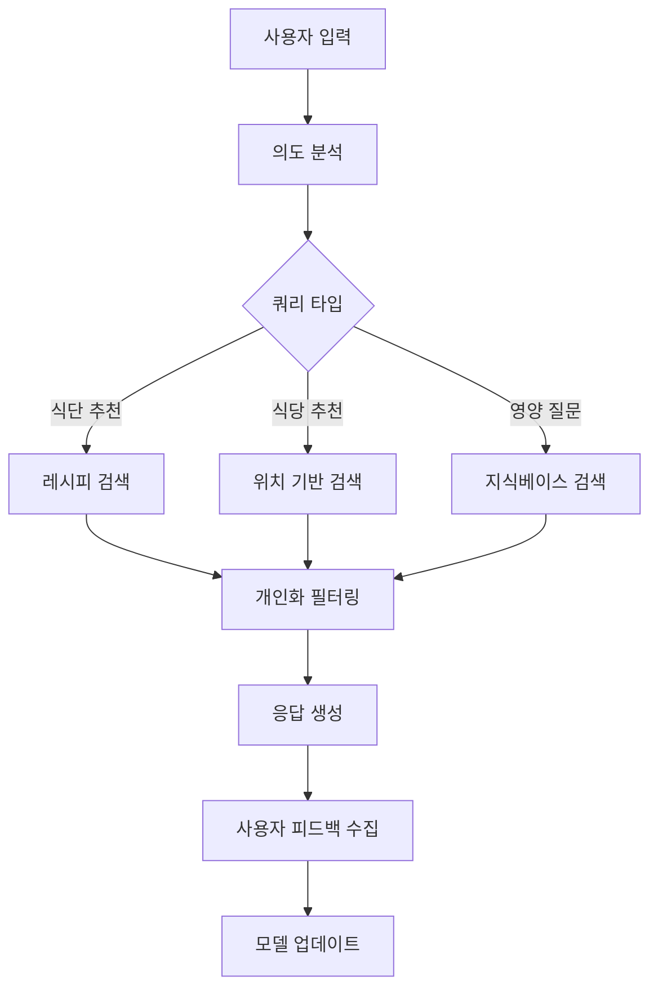

# 키토식단 추천 웹사이트 PRD (Product Requirements Document)

## 📋 프로젝트 개요

### 제품명
**KetoHelper** - 키토제닉 다이어트 추천 및 관리 플랫폼

### 프로젝트 목표
키토제닉 다이어트를 시작하거나 유지하는 사용자들에게 개인화된 식단 추천, 식당 정보, 그리고 AI 기반 맞춤 서비스를 제공하여 건강한 키토 라이프스타일을 지원합니다.

### 핵심 가치 제안
- 🤖 **AI 기반 개인화**: RAG와 AI Agent를 활용한 맞춤형 추천
- 🍽️ **실용적 정보**: 실시간 식당 정보와 메뉴 추천
- 👤 **개인화 서비스**: 알레르기, 선호도를 고려한 맞춤 서비스
- 📱 **사용자 친화적**: React 기반의 직관적이고 반응형 UI

---

## 🛠️ 기술 스택

### Frontend
- **Framework**: React 18+
- **언어**: TypeScript
- **상태 관리**: Redux Toolkit 또는 Zustand
- **UI 라이브러리**: Material-UI 또는 Chakra UI
- **라우팅**: React Router v6
- **스타일링**: Styled-components 또는 Emotion
- **빌드 도구**: Vite

### Backend
- **Framework**: FastAPI
- **언어**: Python 3.11+
- **데이터베이스**: MongoDB
- **인증**: OAuth 2.0 (Google)
- **API 문서화**: Swagger/OpenAPI

### AI & 데이터
- **RAG 시스템**: LangChain
- **워크플로우**: LangGraph
- **AI Agent**: 커스텀 Agent 구현
- **벡터 데이터베이스**: Pinecone 또는 Weaviate
- **LLM**: OpenAI GPT-4 또는 Claude

### 배포 & 인프라
- **Frontend**: Vercel 또는 Netlify
- **Backend**: AWS EC2 또는 Railway
- **데이터베이스**: MongoDB Atlas
- **CDN**: CloudFlare

---

## 🎯 타겟 사용자

### 주요 페르소나
1. **키토 초보자** (30-45세)
   - 키토 다이어트를 시작하려는 사용자
   - 어떤 음식을 먹어야 할지 모르는 상태
   - 간단하고 명확한 가이드 필요

2. **키토 경험자** (25-40세)
   - 이미 키토를 실행 중인 사용자
   - 다양한 메뉴와 식당 정보 필요
   - 더 정교한 개인화 서비스 원함

3. **바쁜 직장인** (28-45세)
   - 시간이 부족한 직장인
   - 빠른 식당 추천과 주문 정보 필요
   - 모바일 우선 사용 패턴

---

## 📱 주요 기능 명세

### 1. 메인 화면 (Home)
**목적**: 사용자 온보딩 및 주요 기능 접근점 제공

#### 주요 구성요소
- **히어로 섹션**
  - 키토다이어트 소개 및 서비스 가치 제안
  - CTA 버튼 (식단 추천 시작하기)
  
- **오늘의 추천**
  - AI 기반 개인화 식단 추천 (로그인 시)
  - 인기 키토 레시피 (비로그인 시)
  
- **퀵 액세스 카드**
  - 식단 추천하기
  - 근처 키토 식당 찾기
  - 키토 가이드
  
- **사용자 상태 대시보드** (로그인 시)
  - 키토 진행 상황
  - 일일 마크로 목표 대비 현황
  - 최근 활동 히스토리

#### 기술 요구사항
- 반응형 디자인 (모바일 퍼스트)
- 지연 로딩으로 성능 최적화
- 사용자 인증 상태에 따른 동적 콘텐츠 렌더링

### 2. 식단 추천 화면 (Meal Recommendations)
**목적**: AI 기반 개인화 키토 식단 추천 제공

#### 주요 구성요소
- **추천 필터링**
  - 식사 시간 (아침/점심/저녁/간식)
  - 조리 시간 (15분 이하, 30분 이하, 1시간 이하)
  - 식재료 기반 필터
  - 칼로리 범위 설정
  
- **AI 추천 엔진**
  - 사용자 선호도 기반 추천
  - 알레르기/비선호 식품 제외
  - 계절성 및 재료 가용성 고려
  - 영양소 균형 최적화

- **레시피 카드**
  - 요리 이미지 및 영양 정보
  - 조리 시간 및 난이도
  - 재료 리스트 및 조리법
  - 마크로 뉴트리언트 분석

- **식단 플래너**
  - 주간 식단 계획 생성
  - 장보기 리스트 자동 생성
  - 칼린더 뷰로 식단 관리

#### AI 기능
- **RAG 시스템**: 키토 레시피 데이터베이스에서 관련 정보 검색
- **개인화 알고리즘**: 사용자 행동 및 선호도 학습
- **영양 분석**: 실시간 마크로뉴트리언트 계산

### 3. 식당 추천 화면 (Restaurant Recommendations)
**목적**: 키토 친화적인 식당 및 메뉴 정보 제공

#### 주요 구성요소
- **위치 기반 검색**
  - GPS 또는 주소 입력을 통한 위치 설정
  - 반경 설정 (500m, 1km, 2km, 5km)
  - 지도 뷰 및 리스트 뷰 전환

- **식당 필터링**
  - 음식 카테고리 (한식, 양식, 일식, 중식 등)
  - 가격대 (₩, ₩₩, ₩₩₩, ₩₩₩₩)
  - 평점 및 리뷰 수
  - 키토 친화도 점수

- **식당 상세 정보**
  - 기본 정보 (주소, 전화번호, 영업시간)
  - 키토 메뉴 추천
  - 사용자 리뷰 및 평점
  - 메뉴별 탄수화물 함량 정보

- **AI 메뉴 분석**
  - 메뉴 이미지에서 키토 적합성 분석
  - 대체 메뉴 제안
  - 주문 시 키토 변경 요청사항 제안

#### 외부 API 연동
- **지도 서비스**: 카카오맵 또는 네이버맵 API
- **식당 정보**: 카카오 로컬 API 또는 네이버 플레이스 API
- **리뷰 데이터**: 자체 수집 + 외부 플랫폼 연동

### 4. 로그인 화면 (Authentication)
**목적**: 안전하고 편리한 사용자 인증 제공

#### 주요 구성요소
- **소셜 로그인**
  - Google OAuth 2.0 통합
  - 원클릭 로그인 경험
  - 프로필 정보 자동 연동

- **게스트 모드**
  - 로그인 없이 기본 기능 이용 가능
  - 제한적 개인화 서비스 제공
  - 로그인 유도 UX

- **사용자 온보딩**
  - 첫 로그인 시 키토 경험 레벨 설문
  - 기본 개인 정보 수집 (선택사항)
  - 알레르기 및 선호도 초기 설정

#### 보안 요구사항
- JWT 토큰 기반 인증
- HTTPS 필수
- 개인정보 처리방침 및 이용약관 동의
- GDPR 준수 데이터 처리

### 5. 사용자 설정 화면 (User Preferences)
**목적**: 개인화 서비스를 위한 사용자 프로필 관리

#### 주요 구성요소
- **기본 프로필**
  - 이름, 이메일 (Google 연동)
  - 키토 경험 레벨
  - 목표 설정 (체중 감량, 유지, 건강 개선)

- **식품 선호도 관리**
  - 선호 음식 카테고리
  - 비선호 음식 설정
  - 알레르기 정보 입력
  - 종교적/개인적 식단 제한사항

- **영양 목표 설정**
  - 일일 칼로리 목표
  - 마크로뉴트리언트 비율 (탄수화물, 단백질, 지방)
  - 체중 목표 및 기간

- **알림 설정**
  - 식사 시간 알림
  - 새로운 추천 알림
  - 주간 리포트 수신 여부

- **데이터 관리**
  - 개인정보 수정
  - 계정 삭제
  - 데이터 내보내기

#### 개인화 엔진
- 사용자 행동 패턴 학습
- 추천 정확도 지속적 개선
- A/B 테스트를 통한 UX 최적화

---

## 🤖 AI 시스템 아키텍처

### RAG (Retrieval-Augmented Generation) 시스템
```
사용자 질문 → 벡터 검색 → 관련 문서 검색 → LLM 답변 생성 → 개인화 필터링 → 최종 응답
```

#### 데이터 소스
- **키토 레시피 데이터베이스**
  - 10,000+ 검증된 키토 레시피
  - 영양성분 정보 포함
  - 사용자 평점 및 리뷰

- **식당 메뉴 데이터**
  - 주요 프랜차이즈 메뉴 정보
  - 탄수화물 함량 데이터
  - 키토 변경 가능 옵션

- **영양학 지식베이스**
  - 키토제닉 다이어트 가이드라인
  - 식품 영양성분 데이터
  - 의학적 권장사항

### LangGraph 워크플로우


### AI Agent 기능
- **식단 계획 에이전트**: 주간 식단 자동 생성
- **영양 분석 에이전트**: 실시간 영양성분 계산
- **식당 추천 에이전트**: 위치와 선호도 기반 추천
- **학습 에이전트**: 사용자 패턴 학습 및 모델 개선

---

## 🗂️ 데이터베이스 스키마

### MongoDB Collections

#### Users Collection
```javascript
{
  _id: ObjectId,
  googleId: String,
  email: String,
  name: String,
  profileImage: String,
  createdAt: Date,
  updatedAt: Date,
  preferences: {
    allergies: [String],
    dislikes: [String],
    dietaryRestrictions: [String],
    experienceLevel: String, // 'beginner', 'intermediate', 'advanced'
    goals: {
      targetWeight: Number,
      targetCalories: Number,
      macroRatio: {
        carbs: Number,
        protein: Number,
        fat: Number
      }
    }
  },
  settings: {
    notifications: {
      mealReminders: Boolean,
      recommendations: Boolean,
      weeklyReport: Boolean
    },
    units: String // 'metric' or 'imperial'
  }
}
```

#### Recipes Collection
```javascript
{
  _id: ObjectId,
  title: String,
  description: String,
  imageUrl: String,
  cookingTime: Number, // minutes
  difficulty: String, // 'easy', 'medium', 'hard'
  servings: Number,
  ingredients: [{
    name: String,
    amount: Number,
    unit: String,
    carbs: Number // per serving
  }],
  instructions: [String],
  nutrition: {
    calories: Number,
    carbs: Number,
    protein: Number,
    fat: Number,
    fiber: Number
  },
  tags: [String],
  rating: Number,
  reviewCount: Number,
  isKetoFriendly: Boolean,
  createdAt: Date,
  embedding: [Number] // for vector search
}
```

#### Restaurants Collection
```javascript
{
  _id: ObjectId,
  name: String,
  address: String,
  location: {
    type: "Point",
    coordinates: [Number, Number] // [longitude, latitude]
  },
  phone: String,
  category: String,
  priceRange: Number, // 1-4
  rating: Number,
  reviewCount: Number,
  operatingHours: [{
    day: String,
    open: String,
    close: String
  }],
  menu: [{
    name: String,
    description: String,
    price: Number,
    carbs: Number,
    isKetoFriendly: Boolean,
    ketoModifications: [String]
  }],
  ketoScore: Number, // 0-100
  images: [String],
  createdAt: Date
}
```

#### User Activities Collection
```javascript
{
  _id: ObjectId,
  userId: ObjectId,
  type: String, // 'recipe_view', 'restaurant_visit', 'meal_log'
  data: Object,
  timestamp: Date
}
```

---

## 🎨 UI/UX 설계 원칙

### 디자인 시스템
- **컬러 팔레트**
  - Primary: 키토 그린 (#2E7D32)
  - Secondary: 따뜻한 오렌지 (#FF8F00)
  - Background: 클린 화이트 (#FFFFFF)
  - Text: 다크 그레이 (#212121)
  - Accent: 소프트 블루 (#1976D2)

- **타이포그래피**
  - Heading: Pretendard Bold
  - Body: Pretendard Regular
  - Caption: Pretendard Light

- **컴포넌트 라이브러리**
  - 재사용 가능한 UI 컴포넌트
  - Storybook을 통한 컴포넌트 문서화
  - 접근성 준수 (WCAG 2.1 AA)

### 사용자 경험 원칙
1. **직관성**: 첫 방문자도 쉽게 이해할 수 있는 인터페이스
2. **개인화**: 사용할수록 더 정확해지는 추천 시스템
3. **반응성**: 모든 디바이스에서 최적화된 경험
4. **신뢰성**: 정확하고 검증된 영양 정보 제공
5. **효율성**: 최소한의 클릭으로 원하는 정보 획득

---

## 📊 성공 지표 (KPIs)

### 사용자 참여도
- **DAU/MAU**: 일일/월간 활성 사용자 수
- **세션 시간**: 평균 사용 시간
- **페이지뷰**: 페이지별 조회수
- **재방문율**: 7일/30일 재방문율

### 서비스 품질
- **추천 정확도**: 사용자 피드백 기반 추천 만족도
- **응답 시간**: API 평균 응답 시간 (<200ms)
- **에러율**: 시스템 에러 발생률 (<1%)
- **가용성**: 서비스 가동률 (>99.9%)

### 비즈니스 목표
- **사용자 증가율**: 월간 신규 사용자 증가율
- **기능 사용률**: 주요 기능별 사용률
- **사용자 만족도**: NPS (Net Promoter Score)
- **콘텐츠 품질**: 레시피/식당 정보 정확도

---

## 🚀 개발 로드맵

### Phase 1: MVP (4주)
- [ ] 기본 React 앱 구조 설정
- [ ] Google OAuth 로그인 구현
- [ ] 기본 UI 컴포넌트 개발
- [ ] MongoDB 스키마 설계 및 구현
- [ ] FastAPI 백엔드 기본 구조
- [ ] 메인 화면 구현

### Phase 2: 핵심 기능 (6주)
- [ ] 식단 추천 시스템 구현
- [ ] 기본 RAG 시스템 구축
- [ ] 사용자 설정 화면 구현
- [ ] 레시피 데이터베이스 구축
- [ ] 기본 AI 추천 엔진

### Phase 3: 고급 기능 (6주)
- [ ] 식당 추천 시스템 구현
- [ ] 위치 기반 서비스 연동
- [ ] LangGraph 워크플로우 구현
- [ ] 개인화 알고리즘 고도화
- [ ] 모바일 최적화

### Phase 4: 최적화 및 배포 (4주)
- [ ] 성능 최적화
- [ ] 보안 강화
- [ ] 테스트 코드 작성
- [ ] 배포 환경 구축
- [ ] 모니터링 시스템 구축

---

## 🛡️ 보안 및 개인정보보호

### 데이터 보안
- **암호화**: 민감 데이터 AES-256 암호화
- **전송 보안**: TLS 1.3 사용
- **접근 제어**: Role-based access control
- **로깅**: 모든 API 요청 로깅 및 모니터링

### 개인정보보호
- **GDPR 준수**: EU 개인정보보호 규정 준수
- **데이터 최소화**: 필요한 최소한의 데이터만 수집
- **사용자 권리**: 데이터 열람, 수정, 삭제 권리 보장
- **투명성**: 개인정보 처리방침 명시

---

## 📈 확장 계획

### 단기 확장 (6개월)
- 모바일 앱 개발 (React Native)
- 추가 소셜 로그인 (카카오, 네이버)
- 키토 쇼핑몰 연동
- 영양사 상담 서비스

### 중기 확장 (1년)
- 다국어 지원 (영어, 일어)
- 워치 앱 연동 (Apple Watch, Galaxy Watch)
- 키토 커뮤니티 기능
- 구독 서비스 모델

### 장기 확장 (2년)
- 다른 다이어트 유형 지원 (팔레오, 비건)
- 헬스케어 플랫폼 연동
- B2B 서비스 (병원, 헬스장)
- 글로벌 서비스 확장

---

## 💰 비용 추정

### 개발 비용
- **인력**: 4명 × 4개월 = 16인월
- **외부 API**: 월 $200-500
- **클라우드 인프라**: 월 $300-800
- **개발 도구**: 월 $100-300

### 운영 비용 (월간)
- **서버 비용**: $500-1,500
- **데이터베이스**: $200-600
- **AI/ML 서비스**: $300-1,000
- **외부 API**: $200-800
- **모니터링**: $100-300

---

## ✅ 마무리

이 PRD는 키토식단 추천 웹사이트의 전체적인 방향성과 구체적인 구현 계획을 제시합니다. React 기반의 재사용 가능한 컴포넌트 구조와 FastAPI, MongoDB, RAG를 활용한 AI 시스템으로 사용자에게 최고의 키토 라이프스타일 경험을 제공할 것입니다.

각 단계별로 구체적인 목표와 성공 지표를 설정하여 프로젝트의 진행 상황을 명확히 추적할 수 있으며, 사용자 피드백을 지속적으로 반영하여 서비스를 개선해 나갈 계획입니다.

---

**문서 버전**: v1.0  
**작성일**: 2024년 12월  
**다음 리뷰**: 개발 시작 후 2주  
