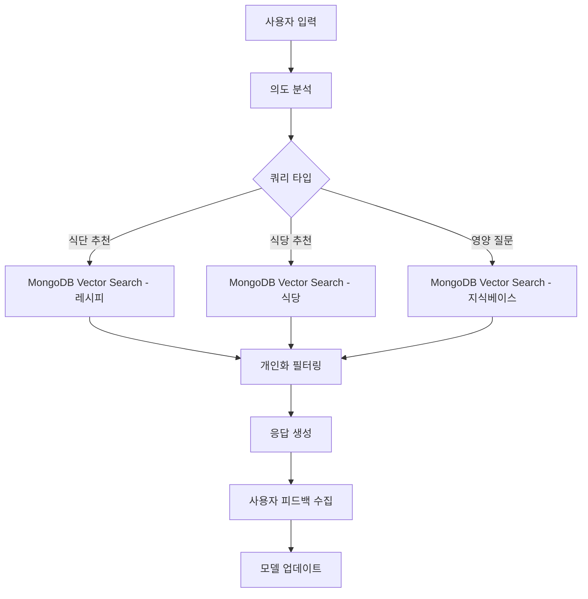

# 🥑 KetoHelper - 키토식단 추천 웹사이트 PRD (Product Requirements Document)

## 📋 프로젝트 개요

### 제품명
**KetoHelper** - 키토제닉 다이어트 추천 및 관리 플랫폼

### 프로젝트 목표
키토제닉 다이어트를 시작하거나 유지하는 사용자들에게 AI 기반 개인화된 식단 추천, 식당 정보, 그리고 맞춤 서비스를 제공하여 건강한 키토 라이프스타일을 지원합니다.

### 핵심 가치 제안
- 🤖 **AI 기반 개인화**: RAG와 AI Agent를 활용한 맞춤형 추천
- 🍽️ **실용적 정보**: 실시간 식당 정보와 메뉴 추천
- 👤 **개인화 서비스**: 알레르기, 선호도를 고려한 맞춤 서비스
- 📱 **사용자 친화적**: React 기반의 직관적이고 반응형 UI
- 💎 **구독 모델**: 프리미엄 기능으로 수익화

---

## 🛠️ 기술 스택 (현재 구현)

### Frontend
- **Framework**: React 18+ with TypeScript
- **빌드 도구**: Vite
- **UI 라이브러리**: Material-UI (MUI)
- **상태 관리**: Zustand
- **라우팅**: React Router v6
- **스타일링**: MUI Theme System
- **개발 도구**: ESLint, Prettier

### Backend
- **Framework**: FastAPI
- **언어**: Python 3.11+
- **데이터베이스**: MongoDB Atlas with Motor (비동기 드라이버)
- **인증**: OAuth 2.0 (Google) + JWT
- **API 문서화**: Swagger/OpenAPI 자동 생성
- **서버**: Uvicorn ASGI

### AI & 데이터
- **RAG 시스템**: LangChain
- **워크플로우**: LangGraph
- **AI Agent**: 커스텀 Agent 구현
- **벡터 데이터베이스**: MongoDB Atlas Vector Search
- **LLM**: OpenAI GPT-4

### 배포 & 인프라
- **Frontend**: Vercel 또는 Netlify
- **Backend**: Railway 또는 AWS EC2
- **데이터베이스**: MongoDB Atlas
- **CDN**: CloudFlare

---

## 🎯 타겟 사용자

### 주요 페르소나
1. **키토 초보자** (30-45세)
   - 키토 다이어트를 시작하려는 사용자
   - 어떤 음식을 먹어야 할지 모르는 상태
   - 간단하고 명확한 가이드 필요

2. **키토 경험자** (25-40세)
   - 이미 키토를 실행 중인 사용자
   - 다양한 메뉴와 식당 정보 필요
   - 더 정교한 개인화 서비스 원함

3. **바쁜 직장인** (28-45세)
   - 시간이 부족한 직장인
   - 빠른 식당 추천과 주문 정보 필요
   - 모바일 우선 사용 패턴

---

## 📱 구현된 주요 기능 명세

### 1. 메인 화면 (HomePage)
**목적**: 사용자 온보딩 및 주요 기능 접근점 제공

#### 구현된 구성요소
- **히어로 섹션**: 키토다이어트 소개 및 서비스 가치 제안
- **퀵 액세스 카드**: 식단 추천, 식당 찾기, 설정 등
- **사용자 상태 대시보드**: 로그인 시 진행 상황 표시
- **반응형 디자인**: 모바일 퍼스트 접근

### 2. 로그인 화면 (LoginPage)
**목적**: 안전하고 편리한 사용자 인증 제공

#### 구현된 기능
- **Google OAuth 2.0**: 원클릭 소셜 로그인
- **게스트 모드**: 로그인 없이 기본 기능 이용
- **데모 로그인**: 프리미엄/무료 사용자 테스트
- **JWT 토큰**: 안전한 세션 관리

### 3. 식단 추천 화면 (MealsPage)
**목적**: AI 기반 개인화 키토 식단 추천 제공

#### 구현 예정 기능
- **추천 필터링**: 식사 시간, 조리 시간, 칼로리 범위
- **AI 추천 엔진**: 사용자 선호도 기반 추천
- **레시피 카드**: 영양 정보, 조리법, 마크로 분석
- **개인화 알고리즘**: 알레르기/비선호 식품 제외

### 4. 식당 추천 화면 (RestaurantsPage)
**목적**: 키토 친화적인 식당 및 메뉴 정보 제공

#### 구현 예정 기능
- **위치 기반 검색**: GPS 및 주소 입력
- **식당 필터링**: 카테고리, 가격대, 평점, 키토 친화도
- **메뉴 분석**: AI 기반 키토 적합성 분석
- **외부 API 연동**: 카카오맵, 네이버 플레이스

### 5. 캘린더 화면 (CalendarPage) - 프리미엄 전용
**목적**: 개인 맞춤 식단 캘린더 관리

#### 구현된 기능
- **월간 캘린더 뷰**: 직관적인 날짜별 식단 관리
- **식단 상세 모달**: 클릭 시 해당 날짜 식단 정보 표시
- **완료 상태 관리**: 아침/점심/저녁 완료 체크
- **진행률 표시**: 주간 실천률 시각화
- **프리미엄 가드**: 구독 사용자만 접근 가능

### 6. 구독 관리 화면 (SubscriptionPage)
**목적**: 프리미엄 구독 서비스 관리

#### 구현된 기능
- **구독 플랜**: 월간(₩9,900) / 연간(₩79,200, 33% 할인)
- **기능 비교**: 무료 vs 프리미엄 기능 차이점
- **결제 다이얼로그**: 신용카드, 카카오페이, 네이버페이
- **구독 관리**: 결제 정보 변경, 자동 갱신, 구독 취소

### 7. 사용자 설정 화면 (PreferencesPage)
**목적**: 개인화 서비스를 위한 사용자 프로필 관리

#### 구현 예정 기능
- **기본 프로필**: 이름, 이메일, 키토 경험 레벨
- **식품 선호도**: 선호/비선호 음식, 알레르기 정보
- **영양 목표**: 일일 칼로리, 마크로 비율, 체중 목표
- **알림 설정**: 식사 알림, 추천 알림, 주간 리포트

### 8. 프로필 화면 (ProfilePage)
**목적**: 사용자 정보 및 진행 상황 관리

#### 구현 예정 기능
- **프로필 정보**: 기본 정보 수정
- **진행 상황**: 체중 변화, 목표 달성률
- **활동 히스토리**: 최근 식단, 추천 이력
- **데이터 관리**: 개인정보 수정, 계정 삭제

### 9. 설정 화면 (SettingsPage)
**목적**: 앱 설정 및 환경 구성

#### 구현 예정 기능
- **알림 설정**: 푸시 알림, 이메일 알림
- **언어 설정**: 한국어, 영어
- **테마 설정**: 라이트/다크 모드
- **데이터 동기화**: 클라우드 백업 설정

---

## 🤖 AI 시스템 아키텍처

### RAG (Retrieval-Augmented Generation) 시스템
```
사용자 질문 → MongoDB Vector Search → 관련 문서 검색 → LLM 답변 생성 → 개인화 필터링 → 최종 응답
```

#### 데이터 소스
- **키토 레시피 데이터베이스**: 10,000+ 검증된 키토 레시피 (MongoDB에 벡터 임베딩 저장)
- **식당 메뉴 데이터**: 주요 프랜차이즈 메뉴 정보 (MongoDB에 벡터 임베딩 저장)
- **영양학 지식베이스**: 키토제닉 다이어트 가이드라인 (MongoDB에 벡터 임베딩 저장)

### LangGraph 워크플로우


### AI Agent 기능
- **식단 계획 에이전트**: 주간 식단 자동 생성
- **영양 분석 에이전트**: 실시간 영양성분 계산
- **식당 추천 에이전트**: 위치와 선호도 기반 추천
- **학습 에이전트**: 사용자 패턴 학습 및 모델 개선

---

## 🗂️ 데이터베이스 스키마 (MongoDB)

### Users Collection
```javascript
{
  _id: ObjectId,
  googleId: String,
  email: String,
  name: String,
  profileImage: String,
  createdAt: Date,
  updatedAt: Date,
  preferences: {
    allergies: [String],
    dislikes: [String],
    dietaryRestrictions: [String],
    experienceLevel: String, // 'beginner', 'intermediate', 'advanced'
    goals: {
      targetWeight: Number,
      targetCalories: Number,
      macroRatio: {
        carbs: Number,
        protein: Number,
        fat: Number
      }
    }
  },
  subscription: {
    isActive: Boolean,
    plan: String, // 'free', 'premium'
    startDate: Date,
    endDate: Date,
    autoRenewal: Boolean
  },
  dietPlan: {
    currentWeight: Number,
    targetWeight: Number,
    intensity: String, // 'low', 'medium', 'high'
    startDate: Date,
    estimatedEndDate: Date,
    daysRemaining: Number,
    dailyCalories: Number,
    macroTargets: {
      carbs: Number,
      protein: Number,
      fat: Number
    }
  }
}
```

### Recipes Collection
```javascript
{
  _id: ObjectId,
  title: String,
  description: String,
  imageUrl: String,
  cookingTime: Number, // minutes
  difficulty: String, // '쉬움', '중간', '어려움'
  servings: Number,
  ingredients: [{
    name: String,
    amount: Number,
    unit: String,
    carbs: Number // per serving
  }],
  instructions: [String],
  nutrition: {
    calories: Number,
    carbs: Number,
    protein: Number,
    fat: Number,
    fiber: Number
  },
  tags: [String],
  rating: Number,
  reviewCount: Number,
  isKetoFriendly: Boolean,
  createdAt: Date,
  embedding: [Number] // MongoDB Atlas Vector Search용 벡터 임베딩
}
```

### MealPlans Collection
```javascript
{
  _id: ObjectId,
  userId: ObjectId,
  date: Date,
  meals: {
    breakfast: ObjectId, // Recipe ID
    lunch: ObjectId,
    dinner: ObjectId
  },
  completed: {
    breakfast: Boolean,
    lunch: Boolean,
    dinner: Boolean
  },
  totalNutrition: {
    calories: Number,
    carbs: Number,
    protein: Number,
    fat: Number,
    fiber: Number
  },
  createdAt: Date,
  updatedAt: Date
}
```

### Restaurants Collection
```javascript
{
  _id: ObjectId,
  name: String,
  address: String,
  location: {
    type: "Point",
    coordinates: [Number, Number] // [longitude, latitude]
  },
  phone: String,
  category: String,
  priceRange: Number, // 1-4
  rating: Number,
  reviewCount: Number,
  operatingHours: [{
    day: String,
    open: String,
    close: String
  }],
  menu: [{
    name: String,
    description: String,
    price: Number,
    carbs: Number,
    isKetoFriendly: Boolean,
    ketoModifications: [String]
  }],
  ketoScore: Number, // 0-100
  images: [String],
  createdAt: Date
}
```

---

## 🎨 UI/UX 설계 원칙

### 디자인 시스템
- **컬러 팔레트**
  - Primary: 키토 그린 (#2E7D32)
  - Secondary: 따뜻한 오렌지 (#FF8F00)
  - Background: 클린 화이트 (#FFFFFF)
  - Text: 다크 그레이 (#212121)
  - Accent: 소프트 블루 (#1976D2)

- **타이포그래피**
  - Heading: Pretendard Bold
  - Body: Pretendard Regular
  - Caption: Pretendard Light

- **컴포넌트 라이브러리**
  - Material-UI 기반 재사용 가능한 컴포넌트
  - 접근성 준수 (WCAG 2.1 AA)
  - 반응형 디자인

### 사용자 경험 원칙
1. **직관성**: 첫 방문자도 쉽게 이해할 수 있는 인터페이스
2. **개인화**: 사용할수록 더 정확해지는 추천 시스템
3. **반응성**: 모든 디바이스에서 최적화된 경험
4. **신뢰성**: 정확하고 검증된 영양 정보 제공
5. **효율성**: 최소한의 클릭으로 원하는 정보 획득

---

## 💰 비즈니스 모델

### 구독 서비스
- **무료 플랜**
  - 기본 키토 레시피 3개
  - 기본 식당 추천 3개
  - 기본 AI 추천
  - 커뮤니티 이용

- **프리미엄 플랜** (월 ₩9,900 / 연 ₩79,200)
  - 개인 맞춤 식단 캘린더
  - 상세 진행률 추적
  - AI 고급 추천 시스템
  - 무제한 레시피 및 식당 정보
  - 우선 고객 지원

### 수익 구조
- **구독 수익**: 월간/연간 구독료
- **광고 수익**: 키토 관련 제품 광고 (향후)
- **제휴 수익**: 식당, 식품 업체 제휴 (향후)

---

## 📊 성공 지표 (KPIs)

### 사용자 참여도
- **DAU/MAU**: 일일/월간 활성 사용자 수
- **세션 시간**: 평균 사용 시간
- **페이지뷰**: 페이지별 조회수
- **재방문율**: 7일/30일 재방문율

### 서비스 품질
- **추천 정확도**: 사용자 피드백 기반 추천 만족도
- **응답 시간**: API 평균 응답 시간 (<200ms)
- **에러율**: 시스템 에러 발생률 (<1%)
- **가용성**: 서비스 가동률 (>99.9%)

### 비즈니스 목표
- **사용자 증가율**: 월간 신규 사용자 증가율
- **구독 전환율**: 무료 → 프리미엄 전환율
- **사용자 만족도**: NPS (Net Promoter Score)
- **콘텐츠 품질**: 레시피/식당 정보 정확도

---

## 🚀 개발 로드맵

### ✅ Phase 1: MVP 완료 (4주)
- [x] 기본 React 앱 구조 설정
- [x] Google OAuth 로그인 구현
- [x] 기본 UI 컴포넌트 개발 (Material-UI)
- [x] MongoDB 스키마 설계 및 구현
- [x] FastAPI 백엔드 기본 구조
- [x] 메인 화면 구현
- [x] 로그인/인증 시스템
- [x] 구독 관리 시스템
- [x] 캘린더 기능 (프리미엄)

### 🔄 Phase 2: 핵심 기능 개발 중 (6주)
- [ ] 식단 추천 시스템 구현
- [ ] 기본 RAG 시스템 구축
- [ ] 사용자 설정 화면 구현
- [ ] 레시피 데이터베이스 구축
- [ ] 기본 AI 추천 엔진
- [ ] 프로필 및 설정 페이지

### 📋 Phase 3: 고급 기능 (6주)
- [ ] 식당 추천 시스템 구현
- [ ] 위치 기반 서비스 연동
- [ ] LangGraph 워크플로우 구현
- [ ] 개인화 알고리즘 고도화
- [ ] 모바일 최적화
- [ ] 결제 시스템 연동

### 🚀 Phase 4: 최적화 및 배포 (4주)
- [ ] 성능 최적화
- [ ] 보안 강화
- [ ] 테스트 코드 작성
- [ ] 배포 환경 구축
- [ ] 모니터링 시스템 구축

---

## 🛡️ 보안 및 개인정보보호

### 데이터 보안
- **암호화**: 민감 데이터 AES-256 암호화
- **전송 보안**: TLS 1.3 사용
- **접근 제어**: JWT 기반 인증
- **로깅**: 모든 API 요청 로깅 및 모니터링

### 개인정보보호
- **GDPR 준수**: EU 개인정보보호 규정 준수
- **데이터 최소화**: 필요한 최소한의 데이터만 수집
- **사용자 권리**: 데이터 열람, 수정, 삭제 권리 보장
- **투명성**: 개인정보 처리방침 명시

---

## 📈 확장 계획

### 단기 확장 (6개월)
- 모바일 앱 개발 (React Native)
- 추가 소셜 로그인 (카카오, 네이버)
- 키토 쇼핑몰 연동
- 영양사 상담 서비스

### 중기 확장 (1년)
- 다국어 지원 (영어, 일어)
- 워치 앱 연동 (Apple Watch, Galaxy Watch)
- 키토 커뮤니티 기능
- 고급 분석 대시보드

### 장기 확장 (2년)
- 다른 다이어트 유형 지원 (팔레오, 비건)
- 헬스케어 플랫폼 연동
- B2B 서비스 (병원, 헬스장)
- 글로벌 서비스 확장

---

## 🔧 개발 환경 설정

### 필요 조건
- **Node.js**: 18.0.0 이상
- **Python**: 3.11 이상
- **MongoDB**: 7.0 이상 (또는 MongoDB Atlas)
- **Git**: 최신 버전

### 설치 및 실행
1. **저장소 클론**
```bash
git clone https://github.com/your-username/mainProject-Team4.git
cd mainProject-Team4
```

2. **자동 설정 스크립트 실행**
```bash
chmod +x scripts/setup.sh
./scripts/setup.sh
```

3. **환경 변수 설정**
```bash
cp env.example .env
# .env 파일을 편집하여 필요한 값들을 설정
```

4. **개발 서버 실행**
```bash
# 백엔드
cd backend
source venv/bin/activate  # Windows: venv\Scripts\activate
uvicorn app.main:app --reload

# 프론트엔드 (새 터미널)
cd frontend
npm run dev
```

---

## ✅ 마무리

이 PRD는 KetoHelper 키토식단 추천 웹사이트의 전체적인 방향성과 구체적인 구현 계획을 제시합니다. React 기반의 재사용 가능한 컴포넌트 구조와 FastAPI, MongoDB, RAG를 활용한 AI 시스템으로 사용자에게 최고의 키토 라이프스타일 경험을 제공할 것입니다.

현재 Phase 1 (MVP)이 완료되어 기본적인 인증, 구독 관리, 캘린더 기능이 구현되었으며, Phase 2에서 핵심 AI 추천 기능을 개발 중입니다.

각 단계별로 구체적인 목표와 성공 지표를 설정하여 프로젝트의 진행 상황을 명확히 추적할 수 있으며, 사용자 피드백을 지속적으로 반영하여 서비스를 개선해 나갈 계획입니다.

---

**문서 버전**: v2.0 (현재 구현 상태 반영)  
**작성일**: 2024년 12월  
**다음 리뷰**: Phase 2 완료 후  
**프로젝트 상태**: 개발 진행 중 (Phase 2)
